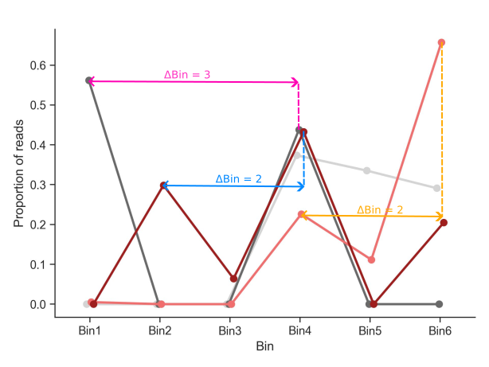

# Snakemake workflow: `gps-orfeome`

[](https://snakemake.github.io)
[](https://github.com/psf/black)
[](https://github.com/niekwit/gps-orfeome/actions/workflows/main.yml)
[](https://doi.org/10.5281/zenodo.15473715)


A Snakemake workflow for `gps-orfeome screen analysis`

## Installation of required software 

Make sure you have [Conda](https://docs.conda.io/projects/conda/en/latest/index.html) installed.

First, install [Snakemake](https://snakemake.readthedocs.io/en/stable/):

```shell
$ conda create -n snakemake bioconda::snakemake=8.25.5
```

It is highly recommended to install [Apptainer](https://apptainer.org):

```shell
$ conda install conda-forge::apptainer=1.3.6
```

To setup a profile for custom `Snakemake` command line arguments, create a new profile (`config.yaml`) in `$HOME/.config/snakemake/standard/`:

```yaml
cores: 40
latency-wait: 10
use-conda: True
rerun-incomplete: True
printshellcmds: True
show-failed-logs: True
use-apptainer: True
```

## Analysis preparation

Prepare an analysis directory as follows:

```shell
.
├── config
│   ├── config.yml
│   └── stats.csv
├── reads
│   ├── Control_1.fastq.gz
│   ├── Control_2.fastq.gz
│   ├── Control_3.fastq.gz
│   ├── Control_4.fastq.gz
│   ├── Control_5.fastq.gz
│   ├── Control_6.fastq.gz
│   ├── Test_1.fastq.gz
│   ├── Test_2.fastq.gz
│   ├── Test_3.fastq.gz
│   ├── Test_4.fastq.gz
│   ├── Test_5.fastq.gz
│   └── Test_6.fastq.gz
├── resources
│   └── uORF_ORF81.csv
└── workflow
    ├── envs
    │   └── stats.yaml
    ├── report
    ├── rules
    │   ├── count.smk
    │   ├── qc.smk
    │   └── stats.smk
    ├── schemas
    │   └── config.schema.yaml
    ├── scripts
    │   ├── calculate_psi.py
    │   ├── create_count_table.py
    │   ├── csv_to_fasta.py
    │   ├── general_functions.smk
    │   ├── plot_alignment_rate.R
    │   ├── plot_barcode_profiles.R
    │   ├── plot_barcoderank.R
    │   ├── plot_coverage.R
    │   ├── plot_lfc.R
    │   ├── plot_missed_barcodes.R
    │   └── rename_to_barcode.py
    └── Snakefile

```


The analysis settings are in `config.yaml`:

```yaml
orfeome_name: uORFbarcodes

# Conditions in experiment
# Sample files should be in reads/ directory
# and have this format condition_1.fastq.gz
# _1 represents the bin number of that condition
conditions:
  test: [Test]
  control: [Control]

# Number of bins set during sorting of cells 
# (should be the same for each sample)
# With bin_number higher than 1, it is assumed that the user wants to perform
# a protein stability analysis using PSI (Protein Stability Index) as a metric.
# With bin_number = 1, the user wants to perform a pairwise comparison 
# of ORF counts between two conditions using MAGeCK/DrugZ.
bin_number: 1

cutadapt:
  # Sequence of an adapter ligated to the 5' end. 
  # The adapter and any preceding bases are trimmed.
  five_prime_adapter: CCAGTAGGTCCACTATGAGT
  
  # Sequence of an adapter ligated to the 3' end.
  # The adapter and subsequent bases are trimmed.
  three_prime_adapter: AGCTGTGTAAGCGGAACTAG

  # Length of barcode sequence
  # This option will override 3'adapter sequence trimming if > 0
  barcode_length: 20
  
  # Extra cutadapt arguments
  extra: "--discard-untrimmed" 

csv: 
  # CSV file with the gene/ORF/barcode information
  # 0-indexed column numbers (First column is 0)
  gene_column: 4 # Column number with gene names
  orf_column: 2 # Column number with unique ORF names
  barcode_id_column: 0 # Column with unique barcode IDs
  sequence_column: 1 # Column number with barcode sequences

# Mismatches allowed during alignment
mismatch: 0 

# MAGeCK/DrugZ can be used when bin_number is set to 1
mageck:
  run: True # Run MAGeCK analysis
  extra_mageck_arguments: "--sort-criteria pos" 
  mageck_control_barcodes: all # All or file with control barcodes
  fdr: 0.25 # FDR threshold for downstream mageck analysis

# DrugZ can be used when bin_number is set to 1
drugz:
  run: True # Run DrugZ analysis
  extra: "" # Extra DrugZ arguments

# Settings for the protein stability analysis when bin number is higher than 1
psi:
  # Minimum value of sum of barcode counts across all bins to keep
  sob_threshold: 100

  # deltaPSI thresholds for hits
  hit_threshold: [0.75, 1.0, 1.25]

  # Exclude barcode with twin peaks
  exclude_twin_peaks: True
  # Proportion threshold for second peak of first peak
  proportion_threshold: [0.5, 0.4, 0.35]  
  
  # Penalty factor for having less than median number of good barcodes
  penalty_factor: [4, 4, 4]

  # Barcode threshold for hits
  # Keep ORFs with at least bc_threshold barcodes
  bc_thresholdreshold: 2
 
  # SD threshold for most stringent hits
  # mean deltaPSI > sd_threshold * SD
  sd_threshold: [2, 2, 2.5]
```


## ORF library data

Information on the ORF library should be stored in a csv file located in `resources/`.

See below for an example:

| ID                    | sequence                 | IOH_ID    | Gene_ID    |
|-----------------------|--------------------------|-----------|------------|
|1_IOH10003_2802_PLD2	  | ATCCGAGTATAGAGACGTAAACTA | IOH10003	 | PLD2       |
|2_IOH10003_2802_PLD2	  | AACTACGTCATGAGCCGGATACCG | IOH10003	 | PLD2       |
|3_IOH10003_2802_PLD2	  | TTGCGCGCTGTGTTGTAACGTTAT | IOH10003	 | PLD2       |
|4_IOH10003_2802_PLD2	  | GACTAGGATGACTACGGAGTTTGC | IOH10003	 | PLD2       |
|5_IOH10003_2802_PLD2	  | GCGTCCTGTTATTCGTGATTGCGC | IOH10003	 | PLD2       |
|6_IOH10004_585_RAB22A	| ATACAGAGTAAGTTTCTCAAAATA | IOH10004	 | RAB22A     |
|7_IOH10004_585_RAB22A	| CGGAGCATCTATTACAGAAAGGTA | IOH10004	 | RAB22A     |

In `config/config.yaml` set the columns for this info as follows:

```yaml
csv: 
  # CSV file with the gene/ORF/barcode information
  # 0-indexed column numbers (First column is 0)
  gene_column: 3 # Column number with gene names
  orf_column: 2 # Column number with unique ORF names
  barcode_id_column: 0 # Column with unique barcode IDs
  sequence_column: 1 # Column number with barcode sequences
```


## Usage

To test the workflow, execute a dry-run first:

```shell
$ snakemake -np
```

To create a rule graph:

```shell
$ mkdir images
$ snakemake --forceall --rulegraph | grep -v '\-> 0\|0\[label = \"all\"' | dot -Tpng > images/rule_graph.png
```

To run the workflow:

```shell
$ snakemake --profile $HOME/.config/snakemake/standard/
```


## Citation

If you use this workflow in a paper, don't forget to give credits to the authors by citing the URL of this (original) repository and its DOI (see above).


# Background
## z-score calculation

With `bin_number` greater than 1, the workflow will perform a protein stability analysis using Protein Stability Index (PSI) as a metric. This is calculated as follows:

$$PSI=\sum_{i=1}^nR_i \times i$$

where:
- $R_i$ is the proportion of the Illumina reads present for an ORF in that given subpopulation $i$.
- $n$ is the number of bins.
- $i$ is the bin number.

Between two conditions (test and control), the $\Delta PSI$ is calculated as:

$$\Delta PSI = PSI_{test} - PSI_{control}$$

Next, the $\Delta PSI$ is normalized to the mean and standard deviation of the $\Delta PSI$ values for all ORFs, resulting in a z-score:

$$z = \frac{\Delta PSI - \mu}{\sigma}$$

where:
- $z$ is the z-score.
- $\mu$ is the mean $\Delta PSI$ for all ORFs.
- $\sigma$ is the standard deviation of $\Delta PSI$ for all ORFs.

The z-score of ORFs with a low number of `good barcodes` (see note below) is corrected, as follows:

```math
z_{corr} =
\begin{cases}
  \frac{z}{\sqrt{ \left( 1 + \frac{m - n}{p} \right) }} & \text{if } n < m \\
  z & \text{if } n \ge m
\end{cases}
```
Where:
- $z_{corr}$ is the corrected $z$.
- $z$ is the z-score.
- $n$ is the number of `good barcodes`.
- $m$ is the median of `good barcodes` of all ORFs.
- $p$ is a user-defined penalty factor.

> [!NOTE]  
> Good barcodes are defined as those which do not have a twin peak in the distribution of their counts across bins. Barcodes with twin peaks are defined as having two peaks that are at least two bins apart $(\Delta Bin > 1)$ and the second peak has to be a minimum proportion of the highest peak. This proportion is defined by the user in the config.yaml file (`proportion_threshold`). See the example below for a visual representation of this. Not all twin peaks are marked in this example.



A final z-score correction is applied to correct for intra-ORF variability:

$$z_{corr}' = \frac{z_{corr}}{SD_{\Delta PSI}} \times \frac{|\Delta PSI|}{h} $$

Where:
- $z_{corr}'$ is the final corrected z-score.
- $SD_{\Delta PSI}$ is the standard deviation of $\Delta PSI$ values of individual ORFs.
- $h$ is a user-defined, absolute, $\Delta PSI$ threshold for calling a hit.
- $|\Delta PSI|$ is the absolute value of $\Delta PSI$ for the individual ORF.

## z-score scaling

We next scaled the z-cores to a range of -128 to -2 for negative z-scores and 2 to 128 for positive z-scores, followed by log2 transformation. As the z-score's direction is important, we are scaling the positive and negative z-scores separately.

### Positive z-score scaling
The scaled positive values, $z_{spos}$, are calculated and log2 transformed as follows:

$$z_{spos} = log2(L_{pos} + \frac{z_{corr}' - min(D_{pos})}{max(D_{pos}) - min(D_{pos})} \times (U_{pos} - L_{pos}))$$

Where:

- $z_{spos}$ is the scaled positive z-score.
- $z_{corr}'$ is the corrected z-score.
- $D_{pos}$ represents all the positive values among all $z_{corr}'$ values.
- $L_{pos}$ is the desired lower bound for the scaled positive values (2).
- $U_{pos}$ is the desired upper bound for the scaled positive values (128).

### Negative z-score scaling
The scaled negative values, $z_{sneg}$, are calculated and log2 transformed as follows:

$$z_{sneg} = -log2(L_{neg} + \frac{(z_{corr}' - \min(D_{neg}))}{(\max(D_{neg}) - \min(D_{neg}))} \times (U_{neg} - L_{neg}))$$

Where:

- $z_{sneg}$ is the scaled negative z-score.
- $z_{corr}'$ is the corrected z-score.
- $D_{neg}$ represents all the negative values among all $z_{corr}'$ values.
- $L_{neg}$ is the desired lower bound for the scaled negative values (-128).
- $U_{neg}$ is the desired upper bound for the scaled negative values (-2).

