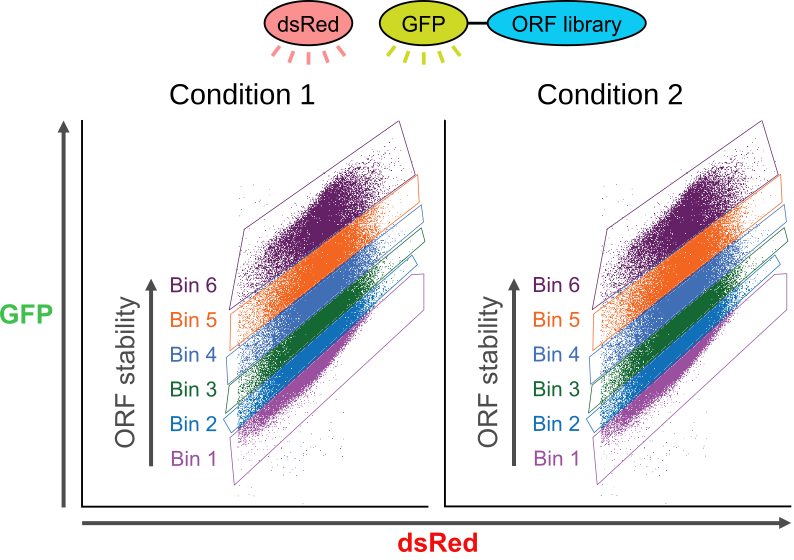
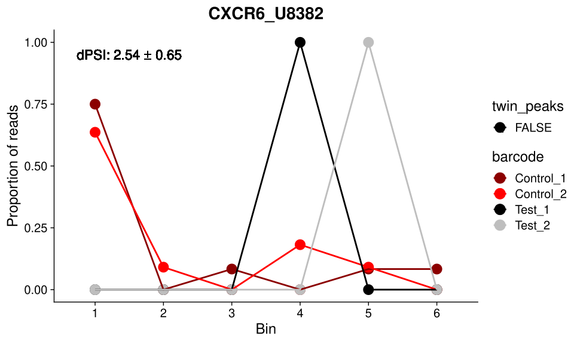
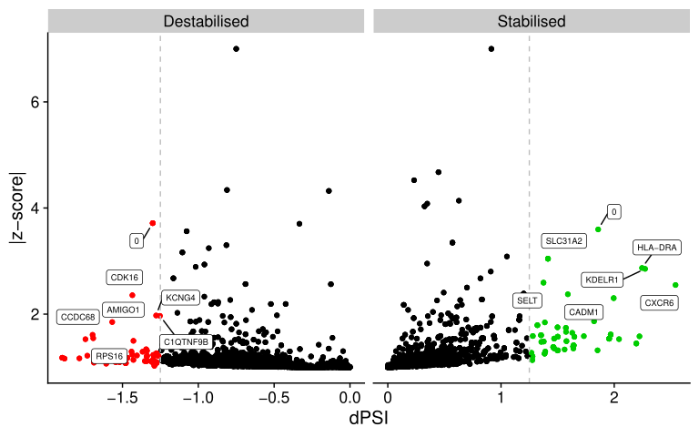
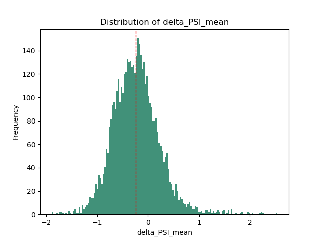
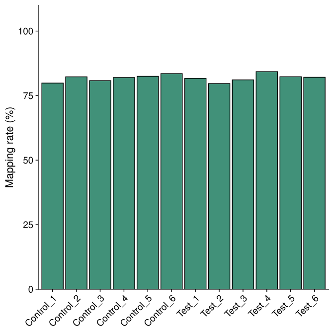
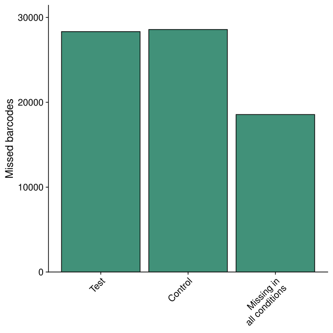
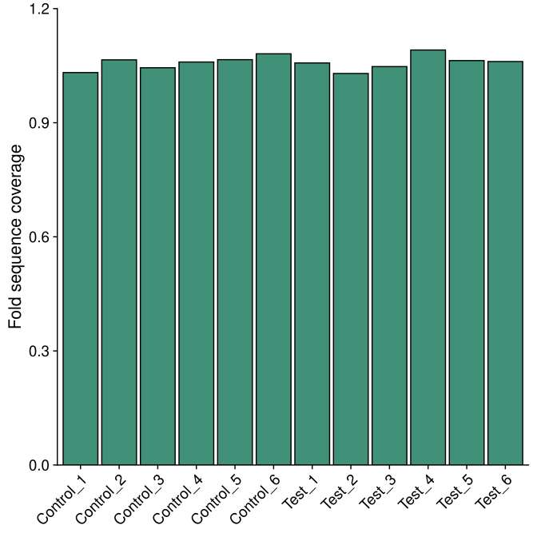
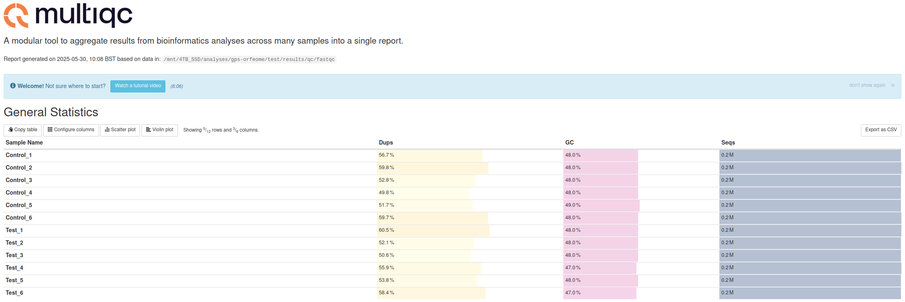

# GPSW

[](https://snakemake.github.io)
[](https://github.com/psf/black)
[](https://github.com/niekwit/gps-orfeome/actions/workflows/main.yml)
[](https://doi.org/10.5281/zenodo.15473715)

[](https://anaconda.org/bioconda/gpsw) 
[](https://anaconda.org/bioconda/gpsw) 


## Description

`GPSW` is a tool for analysing Global Protein Stability Profiling data.

It can deal with two types of experiments:
1. **Protein stability profiling** using Protein Stability Index (PSI) as a metric, which is calculated from the proportion of reads across multiple bins. Publications that include this type of data are [Koren et al. Cell 2018](https://pubmed.ncbi.nlm.nih.gov/29779948/) and [Timms et al. Science 2019](https://pubmed.ncbi.nlm.nih.gov/31273098/).



2. **Pairwise comparison** of ORF counts between two conditions using MAGeCK/DrugZ 


## Installation of required software 

It is recommended to run `GPSW` on a Linux-based system (e.g. Ubuntu). 

Make sure you have [Conda](https://docs.conda.io/projects/conda/en/latest/index.html) installed.

### Installation of stable version via Conda

```shell
$ conda create -n gpsw bioconda::gpsw pandas=2.2.3  pygments=2.19.1
```

This will install the stable version of `GPSW` and all of its dependencies. This is the recommended way to install `GPSW`.

### Installation of development version

First, create a Conda env with the dependencies:

```shell
$ conda create -n gpsw snakemake=8.25.5 apptainer=1.4.0 pandas=2.2.3  pygments=2.19.1
```

> [!NOTE]  
> If you want you use Apptainer, it is essential to install Snakemake v8.25.5, as later versions might not work with the pre-build image.

To install `GPSW`:

```shell
$ cd /path/to/clone/gpsw
$ git clone https://github.com/niekwit/gps-orfeome.git
$ cd gps-orfeome
$ pip install -e .
```

At a later point, `GPSW` can be updated:

```shell
$ git pull
```

## `GPSW` sub-commands and command line arguments

```shell
$ gpsw --version
gpsw 0.6.3

$ gpsw --help
usage: gpsw [-h] [--version] {fetch,run} ...

GPSW: A tool for analysing and processing Global Protein Stability Profiling
data.

positional arguments:
  {fetch,run}  Sub-command help

options:
  -h, --help   show this help message and exit
  --version    show programs version number and exit

$ gpsw fetch --help
usage: gpsw fetch [-h] [-t TAG] [--test-data] [-d DIRECTORY]

Fetch GPSW code from a specific release from https://github.com/niekwit/gps-
orfeome.

options:
  -h, --help            show this help message and exit
  -t TAG, --tag TAG     Release tag of the code to download
  --test-data           Include test data in the download (and relating config
                        and resources directories)
  -d DIRECTORY, --directory DIRECTORY
                        Directory to download the code to target diectory
                        (default: current directory)

$ gpsw run --help
usage: gpsw run [-h] [-p PROFILE] [--snakemake-args SNAKEMAKE_ARGS] [-d] [-q]

Run the GPSW pipeline and create report.

options:
  -h, --help            show this help message and exit
  -p PROFILE, --profile PROFILE
                        Path to Snakemake profile YAML file (only has to be
                        provided at first run) (OPTIONAL, use value None for
                        no profile)
  --snakemake-args SNAKEMAKE_ARGS
                        Extra Snakemake arguments (should be '"double-
                        quoted"')
  -d, --dry-run         Dry-run workflow only
  -q, --quiet           Run GPSW quietly
  
```

## Configuration of Snakemake

To setup a profile for custom `Snakemake` command line arguments, create a new profile (`config.yaml`) in `$HOME/.config/snakemake/standard/`:

```yaml
cores: 40
latency-wait: 10
use-conda: True
rerun-incomplete: True
printshellcmds: True
show-failed-logs: True
use-apptainer: True
```

## Run `GPSW` with test data

First activate the `GPSW` Conda env:
```shell
$ conda activate gpsw
```

Download workflow code and small test data set:

```shell
$ cd /path/to/test/dir
$ gpsw fetch --test-data
```

This will download the workflow code, configuration files and test data, and should look as follows:

```shell
.
├── config
│   └── config.yml
├── reads
│   ├── Control_1.fastq.gz
│   ├── Control_2.fastq.gz
│   ├── Control_3.fastq.gz
│   ├── Control_4.fastq.gz
│   ├── Control_5.fastq.gz
│   ├── Control_6.fastq.gz
│   ├── Test_1.fastq.gz
│   ├── Test_2.fastq.gz
│   ├── Test_3.fastq.gz
│   ├── Test_4.fastq.gz
│   ├── Test_5.fastq.gz
│   └── Test_6.fastq.gz
├── resources
│   └── orfs.csv
└── workflow
    ├── envs
    │   └── stats.yaml
    ├── report
    │   ├── alignment-rates.rst
    │   ├── barcoderank.rst
    │   ├── drugz.rst
    │   ├── lfc_neg.rst
    │   ├── lfc_pos.rst
    │   ├── missed-barcodes.rst
    │   ├── multiqc.rst
    │   ├── pca.rst
    │   └── plot-coverage.rst
    ├── rules
    │   ├── count.smk
    │   ├── qc.smk
    │   └── stats.smk
    ├── schemas
    │   └── config.schema.yaml
    ├── scripts
    │   ├── calculate_proportion_of_reads_in_bins.py
    │   ├── calculate_psi.py
    │   ├── count_barcodes.sh
    │   ├── create_count_table.py
    │   ├── csv_to_fasta.py
    │   ├── general_functions.smk
    │   ├── plot_alignment_rate.R
    │   ├── plot_barcode_multi_conditions_profiles.R
    │   ├── plot_barcode_profiles.R
    │   ├── plot_barcoderank.R
    │   ├── plot_coverage.R
    │   ├── plot_dotplot.R
    │   ├── plot_lfc.R
    │   ├── plot_missed_barcodes.R
    │   ├── plot_pca.R
    │   └── rename_to_barcode.py
    └── Snakefile

10 directories, 45 files
```

To start the workflow on the test data:

```shell
$ cd /path/to/test/dir
$ gpsw run --profile $HOME/.config/snakemake/standard/
```


> [!NOTE]  
> The `--profile` argument will only have to be provided on the first run of `GPSW`, as it will create a config file (~/.gpsw/config.ini) that will store the profile path. To run `GPSW` without a profile use `--profile None`.


## Run `GPSW` with your own data data

Download workflow code:

```shell
$ cd /path/to/analysis/dir
$ gpsw fetch
```


### Workflow settings

Workflow setting are in `config.yaml`:

```yaml
orfeome_name: uORFbarcodes

# Conditions in experiment
# Sample files should be in reads/ directory
# and have this format condition_1.fastq.gz
# _1 represents the bin number of that condition
conditions:
  test: [Test]
  control: [Control]

# Number of bins set during sorting of cells 
# (should be the same for each sample)
# With bin_number higher than 1, it is assumed that the user wants to perform
# a protein stability analysis using PSI (Protein Stability Index) as a metric.
# With bin_number = 1, the user wants to perform a pairwise comparison 
# of ORF counts between two conditions using MAGeCK/DrugZ.
bin_number: 6

cutadapt:
  # Sequence of an adapter ligated to the 5' end. 
  # The adapter and any preceding bases are trimmed.
  five_prime_adapter: CCAGTAGGTCCACTATGAGT
  
  # Sequence of an adapter ligated to the 3' end.
  # The adapter and subsequent bases are trimmed.
  three_prime_adapter: AGCTGTGTAAGCGGAACTAG

  # Length of barcode sequence
  # This option will override 3'adapter sequence trimming if > 0
  barcode_length: 20
  
  # Extra cutadapt arguments
  extra: "--discard-untrimmed" 

csv: 
  # CSV file with the gene/ORF/barcode information
  # 0-indexed column numbers (First column is 0)
  gene_column: 4 # Column number with gene names
  orf_column: 2 # Column number with unique ORF names
  barcode_id_column: 0 # Column with unique barcode IDs
  sequence_column: 1 # Column number with barcode sequences

# Alignment settings
bowtie2:
  mismatch: 0 # mismatches allowed in the alignment
  extra: "" # Extra arguments for bowtie2

# MAGeCK/DrugZ can be used when bin_number is set to 1
mageck:
  run: True # Run MAGeCK analysis
  extra_mageck_arguments: "--sort-criteria pos" 
  mageck_control_barcodes: all # All or file with control barcodes
  fdr: 0.25 # FDR threshold for downstream mageck analysis

# DrugZ can be used when bin_number is set to 1
drugz:
  run: True # Run DrugZ analysis
  extra: "" # Extra DrugZ arguments

# Settings for the protein stability analysis when bin number is higher than 1
psi:
  # Minimum value of sum of barcode counts across all bins to keep
  sob_threshold: 100

  # deltaPSI thresholds for hits
  hit_threshold: [0.75, 1.0, 1.25]

  # Exclude barcode with twin peaks
  exclude_twin_peaks: True
  # Proportion threshold for second peak of first peak
  proportion_threshold: [0.5, 0.4, 0.35]  
  
  # Penalty factor for having less than median number of good barcodes
  penalty_factor: [4, 4, 4]

  # Barcode threshold for hits
  # Keep ORFs with at least bc_threshold barcodes
  bc_threshold: 2
 
  # SD threshold for most stringent hits
  # mean deltaPSI > sd_threshold * SD
  sd_threshold: [2, 2, 2.5]
```

#### Sample names

The `conditions` section defines the conditions in the experiment. The sample files should be placed in the `reads/` directory and should follow the naming convention `<condition>_<bin_number>.fastq.gz`, where `<condition>` is one of the conditions defined in the `config.yaml` file (e.g. `Test_1.fastq.gz`, `Control_1.fastq.gz`, etc.).

```yaml
conditions:
  test: [Test]
  control: [Control]
```

`GPSW` calculates $\Delta PSI$ values by pairing corresponding test and control conditions. For instance, if you define tests as `[Test1, Test2]` and controls as `[Control1, Control2]`, `GPSW` will compare Test1 with Control1 and Test2 with Control2. It's essential that all samples share the same `bin_number`.


#### Bin number

If the `bin_number` is set to 1, the workflow will perform a pairwise comparison of ORF counts between two conditions using MAGeCK/DrugZ. If the `bin_number` is greater than 1, the workflow will perform a protein stability analysis using Protein Stability Index (PSI) as a metric.

```yaml
bin_number: 6
```

#### Cutadapt settings

The `cutadapt` section defines the settings for trimming the raw reads. The `five_prime_adapter` and `three_prime_adapter` are the sequences of the adapters ligated to the 5' and 3' ends of the reads, respectively. The `barcode_length` is the length of the barcode sequence, which will override the 3' adapter sequence trimming if set to a value greater than 0.

Extra arguments for `cutadapt` can be specified in the `extra` field. For example, `--discard-untrimmed` will discard reads that were not trimmed (recommended).

```yaml
cutadapt:
  # Sequence of an adapter ligated to the 5' end. 
  # The adapter and any preceding bases are trimmed.
  five_prime_adapter: CCAGTAGGTCCACTATGAGT
  
  # Sequence of an adapter ligated to the 3' end.
  # The adapter and subsequent bases are trimmed.
  three_prime_adapter: AGCTGTGTAAGCGGAACTAG

  # Length of barcode sequence
  # This option will override 3'adapter sequence trimming if > 0
  barcode_length: 20
  
  # Extra cutadapt arguments
  extra: "--discard-untrimmed" 
```

#### ORF library information

Provide a CSV file with the ORF library information in `resources/` directory. The CSV file should contain the following columns: `ID`, `sequence`, `IOH_ID`, and `Gene_ID`. See the example below:


| ID                    | sequence                 | IOH_ID    | Gene_ID    |
|-----------------------|--------------------------|-----------|------------|
|1_IOH10003_2802_PLD2	  | ATCCGAGTATAGAGACGTAAACTA | IOH10003	 | PLD2       |
|2_IOH10003_2802_PLD2	  | AACTACGTCATGAGCCGGATACCG | IOH10003	 | PLD2       |
|3_IOH10003_2802_PLD2	  | TTGCGCGCTGTGTTGTAACGTTAT | IOH10003	 | PLD2       |
|4_IOH10003_2802_PLD2	  | GACTAGGATGACTACGGAGTTTGC | IOH10003	 | PLD2       |
|5_IOH10003_2802_PLD2	  | GCGTCCTGTTATTCGTGATTGCGC | IOH10003	 | PLD2       |
|6_IOH10004_585_RAB22A	| ATACAGAGTAAGTTTCTCAAAATA | IOH10004	 | RAB22A     |
|7_IOH10004_585_RAB22A	| CGGAGCATCTATTACAGAAAGGTA | IOH10004	 | RAB22A     |

In `config/config.yaml` set the columns for this info as follows:

```yaml
csv: 
  # CSV file with the gene/ORF/barcode information
  # 0-indexed column numbers (First column is 0)
  gene_column: 3 # Column number with gene names
  orf_column: 2 # Column number with unique ORF names
  barcode_id_column: 0 # Column with unique barcode IDs
  sequence_column: 1 # Column number with barcode sequences
```

#### Alignment settings

`GPSW` uses `Bowtie2` for aligning the reads to the ORF library. The `bowtie2` section defines the settings for the alignment. The `mismatch` is the number of mismatches allowed in the alignment, and `extra` can be used to specify additional arguments for `Bowtie2`.

```yaml
bowtie2:
  mismatch: 0 # mismatches allowed in the alignment
  extra: "" # Extra arguments for bowtie2
```

#### MAGeCK/DrugZ settings

When `bin_number` is set to 1, the workflow runs MAGeCK/DrugZ. The `mageck` section defines the settings for the MAGeCK analysis. The `run` field specifies to run MAGeCK/DrugZ analysis, and `extra_mageck_arguments` can be used to specify additional arguments for MAGeCK. The `mageck_control_barcodes` field specifies whether to use all control barcodes or a file with control barcodes. The `fdr` field specifies the FDR threshold for downstream MAGeCK analysis.

```yaml
mageck:
  run: True # Run MAGeCK analysis
  extra_mageck_arguments: "--sort-criteria pos" 
  mageck_control_barcodes: all # All or file with control barcodes
  fdr: 0.25 # FDR threshold for downstream mageck analysis

drugz:
  run: True # Run DrugZ analysis
  extra: "" # Extra DrugZ arguments
```

#### PSI settings

When `bin_number` is greater than 1, the workflow performs a protein stability analysis using PSI as a metric. The `psi` section defines the settings for the PSI analysis. The `sob_threshold` is the minimum value of the sum of barcode counts across all bins to keep an ORF (100 is recommended). The `hit_threshold`, `proportion_threshold`, and `penalty_factor` are lists of values that define the thresholds for hits, proportion of reads in bins, and penalty factor for having less than median number of good barcodes, respectively. The `bc_threshold` is the minimum number of 'good' barcodes required to keep an ORF (examples in Note below), and the `sd_threshold` is the SD threshold for marking high confidence hits (i.e is  $\Delta PSI$ > n $\times$ SD, with n the `sd_threshold`). More on the PSI analysis can be found in the [Background](#background) section below.

```yaml
psi:
  # Minimum value of sum of barcode counts across all bins to keep
  sob_threshold: 100

  # deltaPSI thresholds for hits
  hit_threshold: [0.75, 1.0, 1.25]

  # Exclude barcode with twin peaks
  exclude_twin_peaks: True
  # Proportion threshold for second peak of first peak
  proportion_threshold: [0.5, 0.4, 0.35]  
  
  # Penalty factor for having less than median number of good barcodes
  penalty_factor: [4, 4, 4]

  # Barcode threshold for hits
  # Keep ORFs with at least bc_threshold barcodes
  bc_threshold: 2
 
  # SD threshold for most stringent hits
  # mean deltaPSI > sd_threshold * SD
  sd_threshold: [2, 2, 2.5]
```

> [!NOTE]  
> Good barcodes are defined as those which do not have a twin peak in the distribution of their counts across bins. Barcodes with twin peaks are defined as having two peaks that are at least two bins apart $(\Delta Bin > 1)$ and the second peak has to be a minimum proportion of the highest peak. This proportion is defined by the user in the config.yaml file (`proportion_threshold`). See the example below for a visual representation of this. Not all twin peaks are marked in this example.


### Running the workflow

To initiate the workflow, run the following command:

```shell
$ gpsw run
```

It will first create a rule graph (located in `images/`) of the workflow:

")

The workflow will then be executed, and the results will be stored in the `results/` directory. The results include:

```shell
results/
├── count
│   └── counts-aggregated.tsv
├── psi
│   └── hit-th1.25_sd-th2.25_prop_th0.4_pen_th4
│       ├── Test_vs_Control_barcode.proportions.csv
│       ├── Test_vs_Control_barcode.summary.csv
│       └── Test_vs_Control_gene.summary.csv
├── psi_plots
│   └── hit-th1.25_sd-th2.25_prop_th0.4_pen_th4
│       ├── Test_vs_Control
│       │   ├── destabilised_in_Test
│       │   │   └── ...pdf
│       │   ├── destabilised_in_Test_hc
│       │   │   └── ...pdf
│       │   ├── stabilised_in_Test
│       │   │   └── ...pdf
│       │   └── stabilised_in_Test_hc
│       │       └── ...pdf
│       ├── Test_vs_Control_dotplot.pdf
│       └── Test_vs_Control_dpsi_histogram.png
├── qc
│   ├── alignment-rates.pdf
│   ├── fastqc
│   │   ├── Control_1_fastqc.zip
│   │   ├── Control_1.html
│   │   ├── Control_2_fastqc.zip
│   │   ├── Control_2.html
│   │   ├── Control_3_fastqc.zip
│   │   ├── Control_3.html
│   │   ├── Control_4_fastqc.zip
│   │   ├── Control_4.html
│   │   ├── Control_5_fastqc.zip
│   │   ├── Control_5.html
│   │   ├── Control_6_fastqc.zip
│   │   ├── Control_6.html
│   │   ├── Test_1_fastqc.zip
│   │   ├── Test_1.html
│   │   ├── Test_2_fastqc.zip
│   │   ├── Test_2.html
│   │   ├── Test_3_fastqc.zip
│   │   ├── Test_3.html
│   │   ├── Test_4_fastqc.zip
│   │   ├── Test_4.html
│   │   ├── Test_5_fastqc.zip
│   │   ├── Test_5.html
│   │   ├── Test_6_fastqc.zip
│   │   └── Test_6.html
│   ├── missed-barcodes.pdf
│   ├── multiqc.html
│   └── sequence-coverage.pdf
└── trimmed
    ├── Control_1.qc.txt
    ├── Control_2.qc.txt
    ├── Control_3.qc.txt
    ├── Control_4.qc.txt
    ├── Control_5.qc.txt
    ├── Control_6.qc.txt
    ├── Test_1.qc.txt
    ├── Test_2.qc.txt
    ├── Test_3.qc.txt
    ├── Test_4.qc.txt
    ├── Test_5.qc.txt
    └── Test_6.qc.txt

13 directories, 180 files
```
### Output files by directory

#### Count

The `count` directory contains the aggregated, non-normalised counts of barcodes across all conditions and bins (`counts-aggregated.tsv`).

#### PSI

For each combination of hit threshold, SD threshold, proportion threshold and penalty factor, the `psi` directory contains the following files:

- `Test_vs_Control_barcode.proportions.csv`: a CSV file with the proportions of reads in each bin for each barcode.
- `Test_vs_Control_barcode.summary.csv`: a CSV file with barcode-level results.
- `Test_vs_Control_gene.summary.csv`: a CSV file with the gene-level results. This file contains, among others, the z-scores for each gene, and whether a gene is stabilised/destabilised in the test condition compared to the control condition, as well as an associated ranking.

#### PSI Plots

The `psi_plots` directory contains the following subdirectories for each combination of hit threshold, SD threshold, proportion threshold and penalty factor:

- `Test_vs_Control`: contains the following subdirectories:
  - `destabilised_in_Test`: contains PDF files with the barcode profiles for each destabilised gene in the test condition.
  - `destabilised_in_Test_hc`: contains PDF files with the barcode profiles for each destabilised gene in the test condition, with a higher cutoff for the number of barcodes.
  - `stabilised_in_Test`: contains PDF files with the barcode profiles for each stabilised gene in the test condition.
  - `stabilised_in_Test_hc`: contains PDF files with the barcode profiles for each stabilised gene in the test condition, with a higher cutoff for the number of barcodes.

  Example of barcode profile:

  

- `Test_vs_Control_dotplot.pdf`: a PDF file with a dot plot of the z-scores for each gene in the test condition compared to the control condition.

  

- `Test_vs_Control_dpsi_histogram.png`: a PNG file with a histogram of the $\Delta PSI$ values for all genes.

  

#### QC

##### Alignment rates of individual samples

`Bowtie2` alignment rates for each sample are visualised in `alignment-rates.pdf` file.



##### Missed barcodes

The `missed-barcodes.pdf` file contains a plot of the number of barcodes that were not detected in each bin for each condition. This is useful to identify bins with low coverage or issues with barcode detection.



##### Sequence coverage

The `sequence-coverage.pdf` file contains a plot of the sequence coverage across all bins for each condition. This is useful to identify bins with low coverage or issues with barcode detection.



##### MultiQC report

The `multiqc.html` file contains a summary of the quality control metrics for the trimmed reads.



#### Trimmed

The `trimmed` directory contains the quality control files for each sample after trimming with `cutadapt`. These files contain information about the number of reads before and after trimming, the number of reads that were discarded, and the number of reads that were kept.

# Background
## z-score calculation

With `bin_number` greater than 1, the workflow will perform a protein stability analysis using Protein Stability Index (PSI) as a metric. This is calculated as follows:

$$PSI=\sum_{i=1}^nR_i \times i$$

where:
- $R_i$ is the proportion of the Illumina reads present for an ORF in that given subpopulation $i$.
- $n$ is the number of bins.
- $i$ is the bin number.

Between two conditions (test and control), the $\Delta PSI$ is calculated as:

$$\Delta PSI = PSI_{test} - PSI_{control}$$

Next, the $\Delta PSI$ is normalized to the mean and standard deviation of the $\Delta PSI$ values for all ORFs, resulting in a z-score:

$$z = \frac{\Delta PSI - \mu}{\sigma}$$

where:
- $z$ is the z-score.
- $\mu$ is the mean $\Delta PSI$ for all ORFs.
- $\sigma$ is the standard deviation of $\Delta PSI$ for all ORFs.

The z-score of ORFs with a low number of `good barcodes` (see note below) is corrected, as follows:

```math
z_{c} =
\begin{cases}
  \frac{z}{\sqrt{ \left( 1 + \frac{m - n}{p} \right) }} & \text{if } n < m \\
  z & \text{if } n \ge m
\end{cases}
```
Where:
- $z_{c}$ is the corrected $z$.
- $z$ is the z-score.
- $n$ is the number of `good barcodes`.
- $m$ is the median of `good barcodes` of all ORFs.
- $p$ is a user-defined penalty factor (`penalty_factor` in `config.yaml`).

A final z-score correction is applied to correct for intra-ORF variability:

$$
z_{c}' = \begin{cases}
\frac{z_{c}}{\sigma_i} & \text{if } \sigma_i > 0 \\
\frac{z_{c}}{\epsilon} & \text{if } \sigma_i = 0
\end{cases} \times \frac{|\Delta PSI|}{h}
$$


Where:
- $z_{c}'$ is the final corrected z-score.
- $\sigma_{i}$ is the standard deviation of $\Delta PSI$ values of an individual ORF.
- $h$ is a user-defined, absolute, $\Delta PSI$ threshold for calling a hit.
- $|\Delta PSI|$ is the absolute value of $\Delta PSI$ for the individual ORF.
- $\epsilon$ is the lowest $\sigma_i$ of all ORFs (to avoid division by zero).

## z-score scaling

We next scaled the z-cores to a range of -128 to -2 for negative z-scores and 2 to 128 for positive z-scores, followed by log2 transformation. As the z-score's direction is important, we are scaling the positive and negative z-scores separately.

### Positive z-score scaling
The scaled positive values, $z_{spos}$, are calculated and log2 transformed as follows:

$$z_{spos} = log2(L_{pos} + \frac{z_{corr}' - min(D_{pos})}{max(D_{pos}) - min(D_{pos})} \times (U_{pos} - L_{pos}))$$

Where:

- $z_{spos}$ is the scaled positive z-score.
- $z_{corr}'$ is the corrected z-score.
- $D_{pos}$ represents all the positive values among all $z_{corr}'$ values.
- $L_{pos}$ is the desired lower bound for the scaled positive values (2).
- $U_{pos}$ is the desired upper bound for the scaled positive values (128).

### Negative z-score scaling
The scaled negative values, $z_{sneg}$, are calculated and log2 transformed as follows:

$$z_{sneg} = -log2(L_{neg} + \frac{(z_{corr}' - \min(D_{neg}))}{(\max(D_{neg}) - \min(D_{neg}))} \times (U_{neg} - L_{neg}))$$

Where:

- $z_{sneg}$ is the scaled negative z-score.
- $z_{corr}'$ is the corrected z-score.
- $D_{neg}$ represents all the negative values among all $z_{corr}'$ values.
- $L_{neg}$ is the desired lower bound for the scaled negative values (-128).
- $U_{neg}$ is the desired upper bound for the scaled negative values (-2).


## Citation

If you use this workflow in a paper, don't forget to give credits to the authors by citing the URL of this (original) repository and its DOI (see above).


## References

* Hsueh-Chi Sherry Yen, Stephen J. Elledge. Identification of SCF Ubiquitin Ligase Substrates by Global Protein Stability Profiling. **Science** (2008)
* Itay Koren et al. The Eukaryotic Proteome Is Shaped by E3 Ubiquitin Ligases Targeting C-Terminal Degrons. **Cell** (2018)
* Richard T. Timms et al. A glycine-specific N-degron pathway mediates the quality control of protein N-myristoylation. **Science** (2019)