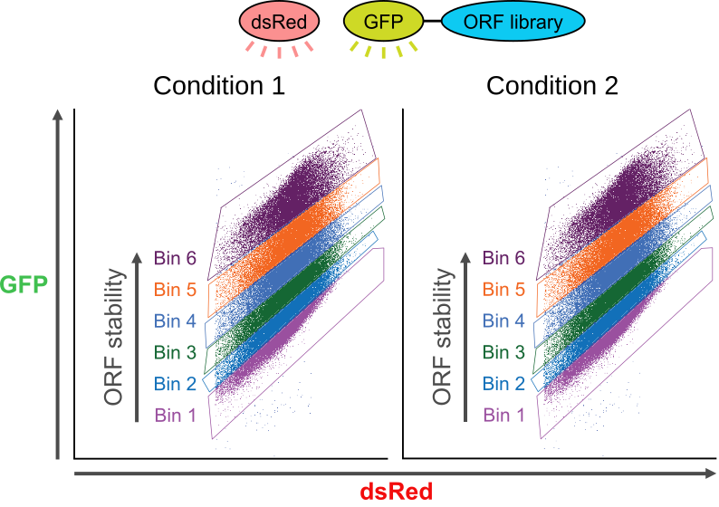

Global Protein Stability Profiling 
==================================================

Global Protein Stability (GPS) Profiling is a powerful genetic method to study the stability of proteins in a single cell.

It relies on a retroviral reporter construct, which contains a single promoter that drives an expression cassette containing an internal ribosome entry site (IRES). This allows the expression of two fluorescent proteins: DsRed and EGPF fused to a protein or peptide of interest (POI). DsRed fluorescence serves as an internal control, while EGFP fluorescence is dependent on the stability of the POI. Importantly, DsRed and EGFP-POI proteins should be produced at a constant ratio because they are translated from the same mRNA.

The EGFP/DsRed ratio, quantifiable by flowcytometry, serves as a direct readout for POI stability. Perturbations that specifically influence EGFP-POI's stability will predictably alter the EGFP-POI abundance without affecting DsRed levels. This selective change in EGFP-X, but not DsRed, will manifest as a measurable shift in the EGFP/DsRed ratio.

During the GPS profiling experiment, cells are sorted using FACS into multiple bins based on their EGFP/DsRed ratio (see Figure 1). Each bin represents a distinct subpopulation of cells with varying EGFP/DsRed ratios. Cell from these bins are then sequenced to determine the abundance of each ORF in each subpopulation. 

   Figure 1: Typical cell sort strategy for PSI analysis (provided by Hudson Coates)

To quantify the stability of each individual ORF in the experiment, the protein stability index (:math:`\Psi`) is calculated for each ORF across the sorted bins. The :math:`\Psi` is a measure of how the abundance of the EGFP-POI changes relative to DsRed across the different bins, reflecting the stability of the POI. It is calculated as follows:

.. math::

   PSI=\sum_{i=1}^nR_i \times i

where:

- :math:`R_i` is the proportion of the Illumina reads present for an ORF in that given subpopulation :math:`i`.
- :math:`n` is the number of bins.
- :math:`i` is the bin number.

Between two experimental conditions (e.g., a test condition and a control condition), the difference in protein stability index is computed for each individual ORF:

.. math::

   dPSI = PSI_{test} - PSI_{control}

Negative :dPSI values indicate that the ORF is less stable in the test condition compared to the control, while positive values indicate greater stability in the test condition.

dPSI values are generated for each barcode of an individual ORF, after which the mean is calculated, :math:`dPSI_i`.

In the :ref:`next section <zscore>`, we will discuss how :math:`dPSI_i` values are converted to robust z-scores, which standardise the data and allow for meaningful comparisons across different datasets.

.. _screen:

Single-bin screen analysis (``bin_number: 1``)
==================================================

When cells are not sorted into multiple bins — for example in a straightforward positive or negative selection screen — set ``bin_number: 1`` in ``config/config.yml``. In this mode the workflow skips the PSI analysis entirely and instead performs a pairwise comparison of ORF counts between the test and control conditions.

The count table is built with one column per sample (no bin dimension), and either or both of the following tools can be used for statistical analysis:

**MAGeCK**

`MAGeCK <https://sourceforge.net/p/mageck/wiki/Home/>`_ (*Model-based Analysis of Genome-wide CRISPR Knockout*) uses a negative binomial model to rank ORFs by their degree of enrichment or depletion between conditions. It produces a gene-level summary (``gene_summary.txt``) and a barcode-level summary (``barcode_summary.txt``), together with log-fold-change (LFC) plots and a barcode rank plot. Enable it by setting ``mageck: run: True`` in the config.

**DrugZ**

`DrugZ <https://github.com/hart-lab/drugz>`_ is a complementary method that converts per-barcode fold changes into normally distributed z-scores and then aggregates them to a gene-level *drugZ score*. Enable it by setting ``drugz: run: True`` in the config.

Both tools can be run simultaneously; their outputs are written to ``results/mageck/`` and ``results/drugz/``, respectively.

The remainder of this documentation focuses on the analysis of multi-bin GPS profiling screens, which is the default mode of the workflow.

