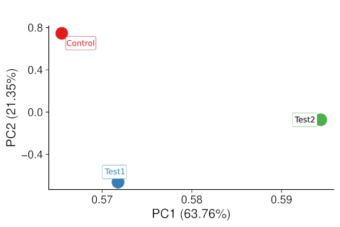
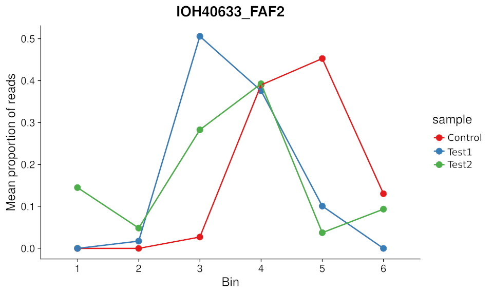

================================================================================
Output files by directory
================================================================================

Images
============

The rule graph (located in `images/`) of the workflow:

.. figure:: images/rulegraph.png
   :alt: Rule graph of the GPSW workflow (dPSI analysis)

   Rule graph of the GPSW workflow (dPSI analysis)

Logs
======

The `logs/` directory contains the log files of the workflow. 

.. dropdown:: Directory structure
   :icon: info
   :color: primary

   .. code-block:: text
      
      logs/
      ├── bowtie2
      │   └── index.log
      ├── calculate_proportion_of_reads_in_bins
      │   └── Test_vs_Control
      │       └── hit-th1.25_sd-th2.25_prop_th0.4_pen_th4.log
      ├── calculate_psi
      │   └── Test_vs_Control
      │       └── hit-th1.25_sd-th2.25_prop_th0.4_pen_th4.log
      ├── count
      │   ├── aggregate_counts.log
      │   ├── Control_1.log
      │   ├── Control_2.log
      │   ├── Control_3.log
      │   ├── Control_4.log
      │   ├── Control_5.log
      │   ├── Control_6.log
      │   ├── Test_1.log
      │   ├── Test_2.log
      │   ├── Test_3.log
      │   ├── Test_4.log
      │   ├── Test_5.log
      │   └── Test_6.log
      ├── create_fasta.log
      ├── cutadapt
      │   ├── Control_1.log
      │   ├── Control_2.log
      │   ├── Control_3.log
      │   ├── Control_4.log
      │   ├── Control_5.log
      │   ├── Control_6.log
      │   ├── Test_1.log
      │   ├── Test_2.log
      │   ├── Test_3.log
      │   ├── Test_4.log
      │   ├── Test_5.log
      │   └── Test_6.log
      ├── fastqc
      │   ├── Control_1.log
      │   ├── Control_2.log
      │   ├── Control_3.log
      │   ├── Control_4.log
      │   ├── Control_5.log
      │   ├── Control_6.log
      │   ├── Test_1.log
      │   ├── Test_2.log
      │   ├── Test_3.log
      │   ├── Test_4.log
      │   ├── Test_5.log
      │   └── Test_6.log
      ├── missed-rgrnas.log
      ├── multiqc
      │   └── multiqc.log
      ├── plot-alignment-rate.log
      ├── plot-coverage.log
      ├── plot_psi
      │   ├── dotplot_hit-th1.25_sd-th2.25_prop_th0.4_pen_th4_Test_vs_Control.log
      │   └── hit-th1.25_sd-th2.25_prop_th0.4_pen_th4_Test_vs_Control.log
      └── snakemake
         ├── 2025-06-05_10-13-21_snakemake.log
         └── 2025-06-05_11-51-32_snakemake.log
   
      11 directories, 49 files

Resources
==========

The `resources/` directory contains the following files/directory:

- `<name>.csv`: a CSV file with the ORF metadata, including the ORF ID, gene name, and other relevant information (placed by the user).
- `<name>.fasta`: a FASTA file with the ORF sequences (generated by GPSW).
- `bowtie2_index/`: a directory containing the Bowtie2 index files for the ORF sequences (generated by GPSW).

Results
==============

The output files of the workflow are stored in the `results/` directory. The structure of the output files is as follows:

.. dropdown:: Directory structure
   :icon: info
   :color: primary

   .. code-block:: text

      results/
      ├── count
      │   └── counts-aggregated.tsv
      ├── psi
      │   └── hit-th1.25_sd-th2.25_prop_th0.4_pen_th4
      │       ├── Test_vs_Control_barcode.proportions.csv
      │       ├── Test_vs_Control_barcode.summary.csv
      │       └── Test_vs_Control_gene.summary.csv
      ├── psi_plots
      │   └── hit-th1.25_sd-th2.25_prop_th0.4_pen_th4
      │       ├── Test_vs_Control
      │       │   ├── destabilised_in_Test
      │       │   │   └── ...pdf
      │       │   ├── destabilised_in_Test_hc
      │       │   │   └── ...pdf
      │       │   ├── stabilised_in_Test
      │       │   │   └── ...pdf
      │       │   └── stabilised_in_Test_hc
      │       │       └── ...pdf
      │       ├── Test_vs_Control_dotplot.pdf
      │       └── Test_vs_Control_dpsi_histogram.png
      ├── qc
      │   ├── alignment-rates.pdf
      │   ├── fastqc
      │   │   ├── Control_1_fastqc.zip
      │   │   ├── Control_1.html
      │   │   ├── Control_2_fastqc.zip
      │   │   ├── Control_2.html
      │   │   ├── Control_3_fastqc.zip
      │   │   ├── Control_3.html
      │   │   ├── Control_4_fastqc.zip
      │   │   ├── Control_4.html
      │   │   ├── Control_5_fastqc.zip
      │   │   ├── Control_5.html
      │   │   ├── Control_6_fastqc.zip
      │   │   ├── Control_6.html
      │   │   ├── Test_1_fastqc.zip
      │   │   ├── Test_1.html
      │   │   ├── Test_2_fastqc.zip
      │   │   ├── Test_2.html
      │   │   ├── Test_3_fastqc.zip
      │   │   ├── Test_3.html
      │   │   ├── Test_4_fastqc.zip
      │   │   ├── Test_4.html
      │   │   ├── Test_5_fastqc.zip
      │   │   ├── Test_5.html
      │   │   ├── Test_6_fastqc.zip
      │   │   └── Test_6.html
      │   ├── missed-barcodes.pdf
      │   ├── multiqc.html
      │   └── sequence-coverage.pdf
      └── trimmed
         ├── Control_1.qc.txt
         ├── Control_2.qc.txt
         ├── Control_3.qc.txt
         ├── Control_4.qc.txt
         ├── Control_5.qc.txt
         ├── Control_6.qc.txt
         ├── Test_1.qc.txt
         ├── Test_2.qc.txt
         ├── Test_3.qc.txt
         ├── Test_4.qc.txt
         ├── Test_5.qc.txt
         └── Test_6.qc.txt

      13 directories, 180 files

Count
--------------------------------------------------------------------------------
The `count` directory contains the aggregated, non-normalised counts of barcodes across all conditions and bins (`counts-aggregated.tsv`).

.. list-table::
   :header-rows: 1
   :widths: 25 10 10 3 3 3 3 3 3 3 3 3 3 3 3 

   * - barcode_id
     - orf_id
     - gene
     - Control_1
     - Control_2
     - Control_3
     - Control_4
     - Control_5
     - Control_6
     - Test_1
     - Test_2
     - Test_3
     - Test_4
     - Test_5
     - Test_6
   * - 1_IOH10003_2802_PLD2
     - IOH10003
     - PLD2
     - 0
     - 2
     - 0
     - 11
     - 12
     - 0
     - 0
     - 5
     - 3
     - 11
     - 9
     - 0
   * - 2_IOH10003_2802_PLD2
     - IOH10003
     - PLD2
     - 1
     - 3
     - 1
     - 11
     - 12
     - 3
     - 0
     - 3
     - 6
     - 13
     - 7
     - 3
   * - 3_IOH10003_2802_PLD2
     - IOH10003
     - PLD2
     - 0
     - 29
     - 8
     - 51
     - 126
     - 66
     - 17
     - 7
     - 36
     - 0
     - 12
     - 0

PSI
--------------------------------------------------------------------------------
For each combination of hit threshold, SD threshold, proportion threshold and penalty factor, the `psi` directory contains the following files:

- ``Test_vs_Control_barcode.proportions.csv``: a CSV file with the proportions of reads in each bin for each barcode.

   .. list-table::
      :header-rows: 1

      * - Comparison
        - barcode_id
        - orf_id
        - gene
        - Control_1
        - Control_2
        - Control_3
        - Control_4
        - Control_5
        - Control_6
        - Test_1
        - Test_2
        - Test_3
        - Test_4
        - Test_5
        - Test_6
        - SOB_Control
        - SOB_Test
        - num_barcodes
        - twin_peaks
        - good_barcodes
        - PSI_Control
        - PSI_Test
        - PSI_Control_mean
        - PSI_Test_mean
        - deltaPSI
        - delta_PSI_mean
        - delta_PSI_SD
        - z_score
        - z_score_corr
      * - Test_vs_Control
        - 18_IOH10009_315_C9orf80
        - IOH10009
        - C9orf80
        - 0.0
        - 0.047619047619047616
        - 0.047619047619047616
        - 0.0
        - 0.42857142857142855
        - 0.47619047619047616
        - 0.034482758620689655
        - 0.0
        - 0.0
        - 0.10344827586206896
        - 0.5517241379310345
        - 0.3103448275862069
        - 21.0
        - 29.0
        - 4
        - False
        - 3
        - 5.238095238095237
        - 5.068965517241379
        - 5.184920634920634
        - 5.116708312510411
        - -0.1691297208538582
        - -0.0682123224102232
        - 0.3114277581445016
        - 0.3669830687507149
        - 1.0101642127567318
      * - Test_vs_Control
        - 19_IOH10009_315_C9orf80
        - IOH10009
        - C9orf80
        - 0.0
        - 0.06666666666666667
        - 0.13333333333333333
        - 0.0
        - 0.26666666666666666
        - 0.5333333333333333
        - 0.0
        - 0.043478260869565216
        - 0.0
        - 0.043478260869565216
        - 0.391304347826087
        - 0.5217391304347826
        - 15.0
        - 23.0
        - 4
        - False
        - 3
        - 5.066666666666666
        - 5.3478260869565215
        - 5.184920634920634
        - 5.116708312510411
        - 0.2811594202898551
        - -0.0682123224102232
        - 0.3114277581445016
        - 0.3669830687507149
        - 1.0101642127567318
      * - Test_vs_Control
        - 20_IOH10009_315_C9orf80
        - IOH10009
        - C9orf80
        - 0.045454545454545456
        - 0.09090909090909091
        - 0.0
        - 0.2727272727272727
        - 0.2727272727272727
        - 0.3181818181818182
        - 0.0
        - 0.0
        - 0.05
        - 0.2
        - 0.65
        - 0.1
        - 22.0
        - 20.0
        - 4
        - True
        - 3
        - 
        - 
        - 5.184920634920634
        - 5.116708312510411
        - 
        - -0.0682123224102232
        - 0.3114277581445016
        - 0.3669830687507149
        - 1.0101642127567318

- ``Test_vs_Control_barcode.summary.csv``: a CSV file with barcode-level results.

   .. list-table::
      :header-rows: 1

      * - barcode_id
        - orf_id
        - gene
        - Control_1
        - Control_2
        - Control_3
        - Control_4
        - Control_5
        - Control_6
        - Test_1
        - Test_2
        - Test_3
        - Test_4
        - Test_5
        - Test_6
        - SOB_Control
        - SOB_Test
        - num_barcodes
        - twin_peaks
        - good_barcodes
        - PSI_Control
        - PSI_Test
        - PSI_Control_mean
        - PSI_Test_mean
        - deltaPSI
        - delta_PSI_mean
        - delta_PSI_SD
        - z_score
        - z_score_corr
      * - 18_IOH10009_315_C9orf80
        - IOH10009
        - C9orf80
        - 0.0
        - 1.0
        - 1.0
        - 0.0
        - 9.0
        - 10.0
        - 1.0
        - 0.0
        - 0.0
        - 3.0
        - 16.0
        - 9.0
        - 21.0
        - 29.0
        - 4
        - False
        - 3
        - 5.238095238095237
        - 5.068965517241379
        - 5.184920634920634
        - 5.116708312510411
        - -0.16912972085385825
        - -0.0682123224102232
        - 0.3114277581445016
        - 0.36698306875071496
        - 1.0101642127567318
      * - 19_IOH10009_315_C9orf80
        - IOH10009
        - C9orf80
        - 0.0
        - 1.0
        - 2.0
        - 0.0
        - 4.0
        - 8.0
        - 0.0
        - 1.0
        - 0.0
        - 1.0
        - 9.0
        - 12.0
        - 15.0
        - 23.0
        - 4
        - False
        - 3
        - 5.066666666666666
        - 5.3478260869565215
        - 5.184920634920634
        - 5.116708312510411
        - 0.2811594202898551
        - -0.0682123224102232
        - 0.3114277581445016
        - 0.36698306875071496
        - 1.0101642127567318
      * - 20_IOH10009_315_C9orf80
        - IOH10009
        - C9orf80
        - 1.0
        - 2.0
        - 0.0
        - 6.0
        - 6.0
        - 7.0
        - 0.0
        - 0.0
        - 1.0
        - 4.0
        - 13.0
        - 2.0
        - 22.0
        - 20.0
        - 4
        - True
        - 3
        - NA
        - NA
        - 5.184920634920634
        - 5.116708312510411
        - NA
        - -0.0682123224102232
        - 0.3114277581445016
        - 0.36698306875071496
        - 1.0101642127567318

- ``Test_vs_Control_gene.summary.csv``: a CSV file with the gene-level results. This file contains, among others, the z-scores for each gene, and whether a gene is stabilised/destabilised in the test condition compared to the control condition, as well as an associated ranking.

   .. list-table::
      :header-rows: 1

      * - orf_id
        - gene
        - delta_PSI_mean
        - delta_PSI_SD
        - num_barcodes
        - good_barcodes
        - stabilised_in_Test
        - stabilised_in_Test_hc
        - destabilised_in_Test
        - destabilised_in_Test_hc
        - z_score
        - z_score_corr
        - stabilised_rank
        - destabilised_rank
      * - IOH10176
        - TYROBP
        - 1.6377777777777773
        - 1.9548950904881863
        - 6
        - 3
        - True
        - False
        - False
        - False
        - 4.207920867801403
        - 1.3896578650327664
        - 31
        - NA
      * - IOH10333
        - C10orf54
        - 1.6477411477411479
        - 1.2578462480865997
        - 4
        - 3
        - True
        - False
        - False
        - False
        - 4.230352817608157
        - 1.5728263375759186
        - 22
        - NA
      * - IOH11069
        - UBD
        - -1.8822843822843824
        - 1.0664291082230677
        - 3
        - 2
        - False
        - False
        - True
        - False
        - -3.7172949960543247
        - NA
        - NA
        - 1

PSI Plots
--------------------------------------------------------------------------------

The `psi_plots` directory contains the following subdirectories for each combination of hit threshold, SD threshold, proportion threshold and penalty factor:

- `Test_vs_Control`: contains the following subdirectories:
   * `destabilised_in_Test`: contains PDF files with the barcode profiles for each destabilised gene in the test condition.
   * `destabilised_in_Test_hc`: contains PDF files with the barcode profiles for each high confidence (:math:`\Delta PSI > 2 \times SD`) destabilised gene in the test condition.
   * `stabilised_in_Test`: contains PDF files with the barcode profiles for each stabilised gene in the test condition.
   * `stabilised_in_Test_hc`: contains PDF files with the barcode profiles for each high confidence (:math:`\Delta PSI > 2 \times SD`) stabilised gene in the test condition.

  Example of barcode profile:

  .. figure:: images/profile.png
     :alt: Barcode profile for a stabilised gene in the test condition

     Barcode profile for a stabilised gene in the test condition

- `Test_vs_Control_dotplot.pdf`: a PDF file with a dot plot of the z-scores for each gene in the test condition compared to the control condition.

  .. figure:: images/dotplot.png
     :alt: Dot plot of z-scores for each gene in the test condition compared to the control condition

     Dot plot of z-scores for each gene in the test condition compared to the control condition

- `Test_vs_Control_dpsi_histogram.png`: a PNG file with a histogram of the :math:`\Delta PSI` values for all genes.

  .. figure:: images/dpsi_histogram.png
     :alt: Histogram of delta PSI values

     Histogram of delta PSI values.

QC
--------------------------------------------------------------------------------

Alignment rates of individual samples
^^^^^^^^^^^^^^^^^^^^^^^^^^^^^^^^^^^^^^^^^^^^^^^^^^^^^^^^^^^^^^^^^^^^^^^^^^^^^^^^
`Bowtie2` alignment rates for each sample are visualised in `alignment-rates.pdf` file.

.. figure:: images/alignment-rates.png
   :alt: Alignment rates of individual samples

   Alignment rates of individual samples.

Missed barcodes
^^^^^^^^^^^^^^^^^^^^^^^^^^^^^^^^^^^^^^^^^^^^^^^^^^^^^^^^^^^^^^^^^^^^^^^^^^^^^^^^
The `missed-barcodes.pdf` file contains a plot of the number of barcodes that were not detected in each bin for each condition. This is useful to identify bins with low coverage or issues with barcode detection.

.. figure:: images/missed-barcodes.png
   :alt: Missed barcodes

   Missed barcodes.

Sequence coverage
^^^^^^^^^^^^^^^^^^^^^^^^^^^^^^^^^^^^^^^^^^^^^^^^^^^^^^^^^^^^^^^^^^^^^^^^^^^^^^^^
The `sequence-coverage.pdf` file contains a plot of the sequence coverage across all bins for each condition. This is useful to identify bins with low coverage or issues with barcode detection.

.. figure:: images/sequence-coverage.png
   :alt: Sequence coverage

   Sequence coverage.

MultiQC report
^^^^^^^^^^^^^^^^^^^^^^^^^^^^^^^^^^^^^^^^^^^^^^^^^^^^^^^^^^^^^^^^^^^^^^^^^^^^^^^^
The `multiqc.html` file contains a summary of the quality control metrics for the trimmed reads.

.. figure:: images/multiqc.png
   :alt: MultiQC report

   MultiQC report.

Trimmed
--------------------------------------------------------------------------------
The `trimmed` directory contains the quality control files for each sample after trimming with `cutadapt`. These files contain information about the number of reads before and after trimming, the number of reads that were discarded, and the number of reads that were kept.

.. dropdown:: Example of a trimmed sample quality control file
   :icon: info
   :color: primary

   .. code-block:: text

      This is cutadapt 4.9 with Python 3.12.10
      Command line parameters: --cores 4 -q 20 -g CCAGTAGGTCCACTATGAGT --length 20 --discard-untrimmed -o results/trimmed/Control_1.fastq.gz reads/Control_1.fastq.gz
      Processing single-end reads on 4 cores ...
      Finished in 0.759 s (4.335 µs/read; 13.84 M reads/minute).

      === Summary ===

      Total reads processed:                 175,000
      Reads with adapters:                   174,492 (99.7%)
      Reads written (passing filters):       174,492 (99.7%)

      Total basepairs processed:    26,250,000 bp
      Quality-trimmed:                  27,953 bp (0.1%)
      Total written (filtered):      3,489,639 bp (13.3%)

      === Adapter 1 ===

      Sequence: CCAGTAGGTCCACTATGAGT; Type: regular 5'; Length: 20; Trimmed: 174492 times

      Minimum overlap: 3
      No. of allowed errors:
      1-9 bp: 0; 10-19 bp: 1; 20 bp: 2

      Overview of removed sequences
      length	count	expect	max.err	error counts
      3	133	2734.4	0	133
      4	1	683.6	0	1
      18	3	0.0	1	2 1
      19	47	0.0	1	6 38 3
      20	19984	0.0	2	17434 2236 314
      21	19934	0.0	2	17471 2165 298
      22	24169	0.0	2	21274 2541 354
      23	25389	0.0	2	22189 2779 421
      24	23155	0.0	2	20282 2529 344
      25	24034	0.0	2	21051 2524 459
      26	20808	0.0	2	18067 2310 431
      27	16792	0.0	2	14576 1895 321
      28	34	0.0	2	13 18 3
      31	1	0.0	2	1
      32	1	0.0	2	0 0 1
      33	1	0.0	2	1
      36	1	0.0	2	1
      37	1	0.0	2	1
      38	1	0.0	2	1
      40	1	0.0	2	1
      47	1	0.0	2	1
      57	1	0.0	2	0 1

Output with multiple test conditions
======================================

When running the workflow with multiple test conditions, additional files will be created in *results/*.

PCA plot
--------------------------------------------------------------------------------
The `qc/pca_plot.pdf` file contains a PCA plot of the ORF counts for all conditions. This plot is useful to visualise the overall distribution of ORF counts across different conditions and to identify potential outliers.

   PCA plot of the ORF counts for all conditions.

Multi condition barcode profile plots
---------------------------------------------------------------------------------

The `psi_plots_multi_conditions` directory contains pdf files with the barcode profiles of mean proportions for each ORF found as hits in both test conditions.

   Profile plot with multiple conditions.