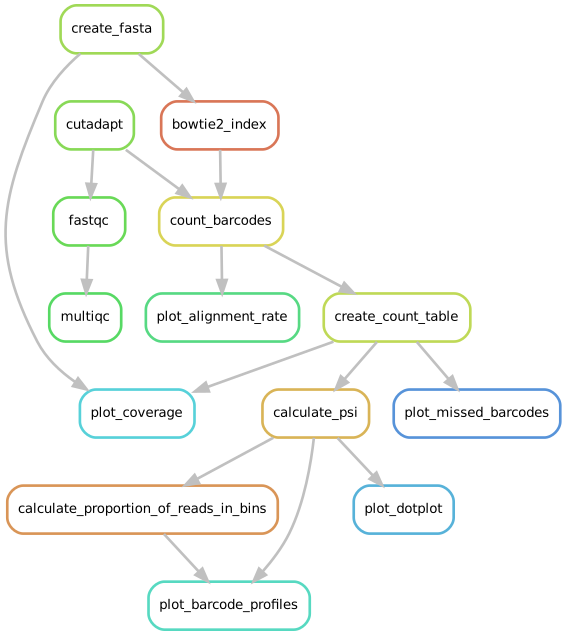
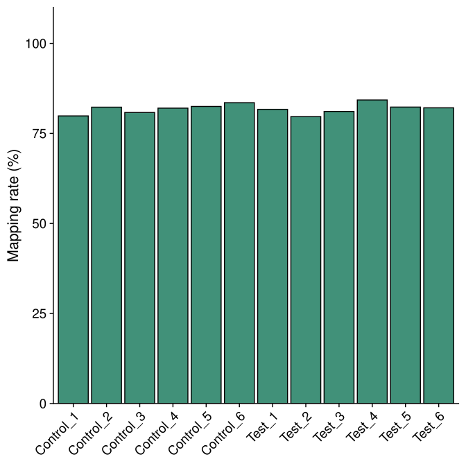
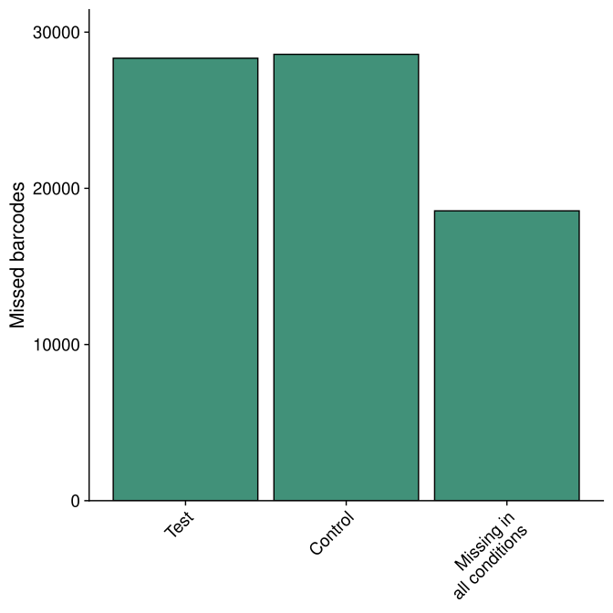
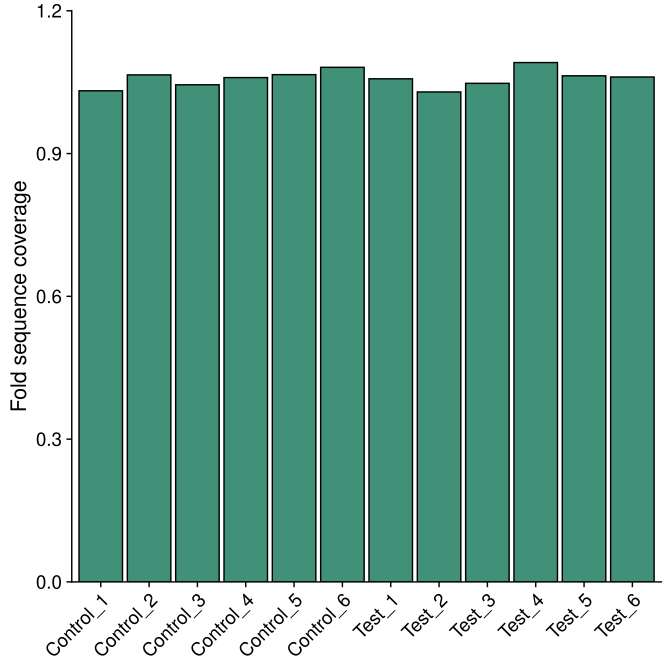
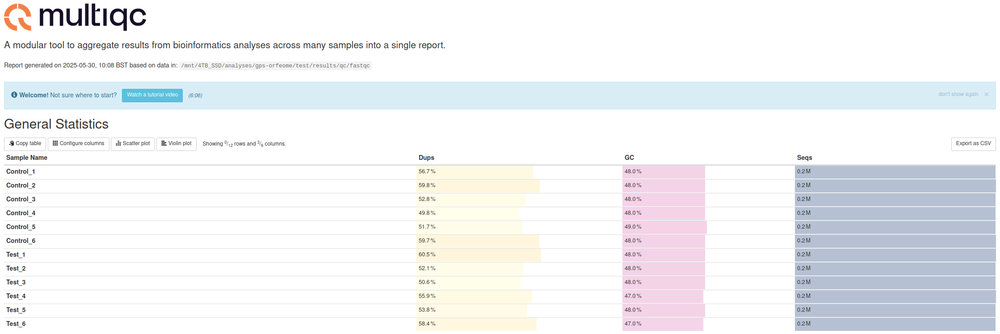

Output files by directory
================================================================================

Running the workflow
--------------------------------------------------------------------------------
To initiate the workflow, run the following command:

.. code-block:: shell

   $ gpsw run

It will first create a rule graph (located in `images/`) of the workflow:

   Rule graph of the GPSW workflow (dPSI analysis)

The workflow will then be executed, and the results will be stored in the `results/` directory. The results include:

.. code-block:: text

   results/
   ├── count
   │   └── counts-aggregated.tsv
   ├── psi
   │   └── hit-th1.25_sd-th2.25_prop_th0.4_pen_th4
   │       ├── Test_vs_Control_barcode.proportions.csv
   │       ├── Test_vs_Control_barcode.summary.csv
   │       └── Test_vs_Control_gene.summary.csv
   ├── psi_plots
   │   └── hit-th1.25_sd-th2.25_prop_th0.4_pen_th4
   │       ├── Test_vs_Control
   │       │   ├── destabilised_in_Test
   │       │   │   └── ...pdf
   │       │   ├── destabilised_in_Test_hc
   │       │   │   └── ...pdf
   │       │   ├── stabilised_in_Test
   │       │   │   └── ...pdf
   │       │   └── stabilised_in_Test_hc
   │       │       └── ...pdf
   │       ├── Test_vs_Control_dotplot.pdf
   │       └── Test_vs_Control_dpsi_histogram.png
   ├── qc
   │   ├── alignment-rates.pdf
   │   ├── fastqc
   │   │   ├── Control_1_fastqc.zip
   │   │   ├── Control_1.html
   │   │   ├── Control_2_fastqc.zip
   │   │   ├── Control_2.html
   │   │   ├── Control_3_fastqc.zip
   │   │   ├── Control_3.html
   │   │   ├── Control_4_fastqc.zip
   │   │   ├── Control_4.html
   │   │   ├── Control_5_fastqc.zip
   │   │   ├── Control_5.html
   │   │   ├── Control_6_fastqc.zip
   │   │   ├── Control_6.html
   │   │   ├── Test_1_fastqc.zip
   │   │   ├── Test_1.html
   │   │   ├── Test_2_fastqc.zip
   │   │   ├── Test_2.html
   │   │   ├── Test_3_fastqc.zip
   │   │   ├── Test_3.html
   │   │   ├── Test_4_fastqc.zip
   │   │   ├── Test_4.html
   │   │   ├── Test_5_fastqc.zip
   │   │   ├── Test_5.html
   │   │   ├── Test_6_fastqc.zip
   │   │   └── Test_6.html
   │   ├── missed-barcodes.pdf
   │   ├── multiqc.html
   │   └── sequence-coverage.pdf
   └── trimmed
       ├── Control_1.qc.txt
       ├── Control_2.qc.txt
       ├── Control_3.qc.txt
       ├── Control_4.qc.txt
       ├── Control_5.qc.txt
       ├── Control_6.qc.txt
       ├── Test_1.qc.txt
       ├── Test_2.qc.txt
       ├── Test_3.qc.txt
       ├── Test_4.qc.txt
       ├── Test_5.qc.txt
       └── Test_6.qc.txt

   13 directories, 180 files

Count
--------------------------------------------------------------------------------
The `count` directory contains the aggregated, non-normalised counts of barcodes across all conditions and bins (`counts-aggregated.tsv`).

PSI
--------------------------------------------------------------------------------
For each combination of hit threshold, SD threshold, proportion threshold and penalty factor, the `psi` directory contains the following files:

- ``Test_vs_Control_barcode.proportions.csv``: a CSV file with the proportions of reads in each bin for each barcode.
- ``Test_vs_Control_barcode.summary.csv``: a CSV file with barcode-level results.
- ``Test_vs_Control_gene.summary.csv``: a CSV file with the gene-level results. This file contains, among others, the z-scores for each gene, and whether a gene is stabilised/destabilised in the test condition compared to the control condition, as well as an associated ranking.

PSI Plots
--------------------------------------------------------------------------------
The `psi_plots` directory contains the following subdirectories for each combination of hit threshold, SD threshold, proportion threshold and penalty factor:

- `Test_vs_Control`: contains the following subdirectories:
  - `destabilised_in_Test`: contains PDF files with the barcode profiles for each destabilised gene in the test condition.
  - `destabilised_in_Test_hc`: contains PDF files with the barcode profiles for each destabilised gene in the test condition, with a higher cutoff for the number of barcodes.
  - `stabilised_in_Test`: contains PDF files with the barcode profiles for each stabilised gene in the test condition.
  - `stabilised_in_Test_hc`: contains PDF files with the barcode profiles for each stabilised gene in the test condition, with a higher cutoff for the number of barcodes.

  Example of barcode profile:

  .. figure:: images/profile.png
     :alt: Barcode profile for a stabilised gene in the test condition

     Barcode profile for a stabilised gene in the test condition

- `Test_vs_Control_dotplot.pdf`: a PDF file with a dot plot of the z-scores for each gene in the test condition compared to the control condition.

  .. figure:: images/dotplot.png
     :alt: Dot plot of z-scores for each gene in the test condition compared to the control condition

     Dot plot of z-scores for each gene in the test condition compared to the control condition

- `Test_vs_Control_dpsi_histogram.png`: a PNG file with a histogram of the :math:`\Delta PSI` values for all genes.

  .. figure:: images/dpsi_histogram.png
     :alt: Histogram of delta PSI values

     Histogram of delta PSI values

QC
--------------------------------------------------------------------------------

Alignment rates of individual samples
^^^^^^^^^^^^^^^^^^^^^^^^^^^^^^^^^^^^^^^^^^^^^^^^^^^^^^^^^^^^^^^^^^^^^^^^^^^^^^^^
`Bowtie2` alignment rates for each sample are visualised in `alignment-rates.pdf` file.

   Alignment rates of individual samples

Missed barcodes
^^^^^^^^^^^^^^^^^^^^^^^^^^^^^^^^^^^^^^^^^^^^^^^^^^^^^^^^^^^^^^^^^^^^^^^^^^^^^^^^
The `missed-barcodes.pdf` file contains a plot of the number of barcodes that were not detected in each bin for each condition. This is useful to identify bins with low coverage or issues with barcode detection.

   Missed barcodes

Sequence coverage
^^^^^^^^^^^^^^^^^^^^^^^^^^^^^^^^^^^^^^^^^^^^^^^^^^^^^^^^^^^^^^^^^^^^^^^^^^^^^^^^
The `sequence-coverage.pdf` file contains a plot of the sequence coverage across all bins for each condition. This is useful to identify bins with low coverage or issues with barcode detection.

   Sequence coverage

MultiQC report
^^^^^^^^^^^^^^^^^^^^^^^^^^^^^^^^^^^^^^^^^^^^^^^^^^^^^^^^^^^^^^^^^^^^^^^^^^^^^^^^
The `multiqc.html` file contains a summary of the quality control metrics for the trimmed reads.

   MultiQC report

Trimmed
--------------------------------------------------------------------------------
The `trimmed` directory contains the quality control files for each sample after trimming with `cutadapt`. These files contain information about the number of reads before and after trimming, the number of reads that were discarded, and the number of reads that were kept.